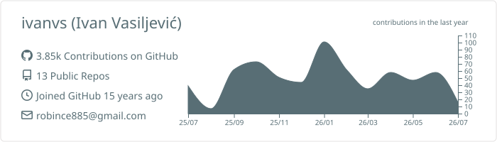
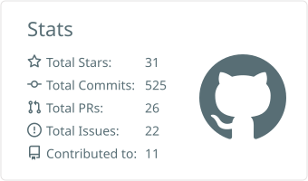
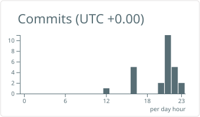
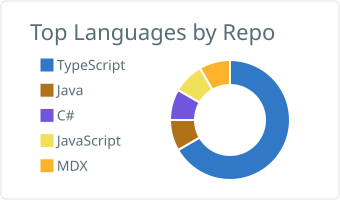
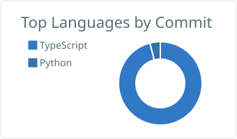

# Hi, I'm Ivan 👋

**Senior Software Engineer — High-Load Systems & Event-Driven Architecture**
14 years of experience building scalable back-end systems in **Java/Spring** and **Node.js**.

## About me

I'm a Senior Software Engineer specializing in building scalable back-end systems for
demanding, high-throughput industries like **iGaming**. My core expertise is the
**Java/Spring** and **Node.js** ecosystems, with a heavy focus on designing and scaling
high-performance **microservices**.

I thrive on the challenges of high-load systems — managing high concurrency, ensuring low
latency, and optimizing real-time data flow. I lean heavily on **Apache Kafka** to build
robust, event-driven systems that scale.

For the last 4 years I've worked in the iGaming domain, building **regulatory reporting**
systems across multiple jurisdictions on a **Kafka + Java/Spring** stack.

- 🏢 &nbsp;Senior Software Engineer at **[Hooloovoo]**, working on high-load regulatory reporting in iGaming
- 🧰 &nbsp;Java · Spring Boot · Spring Cloud · Apache Kafka · AWS · PostgreSQL · DynamoDB
- 📨 &nbsp;Open to interesting senior backend opportunities — feel free to [reach out][linkedin]

> "Do or do not, there is no try."

## What I bring to a team

- **Architectural rigor** — I design systems, not just code: evaluating trade-offs and picking
  the right tool (relational PostgreSQL vs. high-throughput DynamoDB).
- **High-load & event-driven** — high concurrency, low latency, real-time data flow, and
  scalable Kafka-based event streaming.
- **Cloud-native mindset** — AWS Solutions Architect depth; secure, observable, cost-efficient
  applications built with the infrastructure in mind.
- **Clean code & collaboration** — deep discussions on semantics and shared understanding;
  code review and mentoring.

## Tech stack

| Area                  | Technologies                                   |
| --------------------- | ---------------------------------------------- |
| Languages             | Java, JavaScript (ES6+), Python                |
| Backend frameworks    | Spring Boot, Spring Cloud, Nest.js, Express.js |
| Messaging & streaming | Apache Kafka                                   |
| Cloud & DevOps        | AWS, Docker, CI/CD                             |
| Databases             | PostgreSQL, DynamoDB, Redis                    |

      
      
      
      
      
      
      
      
      
      

## Certifications & training

- AWS Certified Solutions Architect – Associate
- Confluent Certified Developer for Apache Kafka

## 📊 GitHub stats

  

  
  

  
  

<!-- links -->

[hooloovoo]: https://hooloovoo.rs/ "Hooloovoo"
[linkedin]: https://www.linkedin.com/in/ivasiljevic/ "Ivan Vasiljevic LinkedIn"
